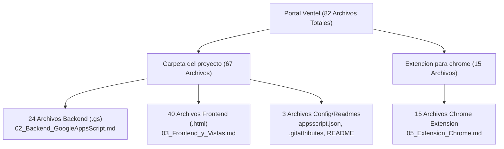

# Portal Ventel — Manual Técnico y Guía de Mantenimiento

> [!NOTE]
> **DOCUMENTACIÓN TÉCNICA OFICIAL DE ARQUITECTURA Y MANTENIMIENTO**  
> Ecosistema Integral de Cotizaciones, Operación y Extensión de Comercio · El Puerto de Liverpool

---

## 📋 Cuadro de Control y Metadatos (Estándar IEEE 1063 / ISO 26514)

| Atributo | Especificación Técnica |
| :--- | :--- |
| **Nombre del Sistema** | Ecosistema Integral Portal Ventel & Extensión Chrome |
| **Ubicación Proyecto Web** | `C:\Users\seguimientos\Desktop\Portal Ventel\Carpeta del proyecto` |
| **Ubicación Extensión** | `C:\Users\seguimientos\Desktop\Portal Ventel\Extencion para chrome` |
| **Versión del Documento** | v1.0 (Auditoría Estándar Empresarial) |
| **Estado del Software** | v0.9 (Pruebas de Control / Producción Inicial) |
| **Stack Principal** | Google Apps Script (V8) + Google Sheets + Chrome Extension (Manifest V3) |
| **Público Objetivo** | Desarrolladores Senior, Arquitectos de Software, Equipo de Mantenimiento y TI Liverpool |
| **Autor y Desarrollador** | **David Martínez** |
| **Correo Institucional** | `dmartineza02@liverpool.com.mx` |
| **Organización** | El Puerto de Liverpool · Equipo Ventel |
| **Fecha de Publicación** | Agosto 2026 |

---

## 🎯 Propósito del Ecosistema

> [!IMPORTANT]
> El Portal Ventel es un software de grado empresarial diseñado para eliminar el error humano en el proceso de ventas y soporte posventa de El Puerto de Liverpool. Permite automatizar la creación de cotizaciones oficiales, auditar precios en tiempo real contra `liverpool.com.mx`, monitorear el estado operativo de los sistemas corporativos (Connect, Página/App, Salesforce, CCAIP) y gestionar atenciones a clientes pospuestas durante caídas operativas.

---

## 📚 Estructura Documental Estandarizada (IEEE 1063)

La documentación técnica del ecosistema está dividida en 8 manuales especializados:

1. 📄 [**`00_README_Inicio.md`**](file:///C:/Users/seguimientos/Desktop/Portal%20Ventel/Documentacion/00_README_Inicio.md): Metadatos, resumen ejecutivo e inventario total verificable (82 archivos).
2. 📄 [**`01_Arquitectura_General.md`**](file:///C:/Users/seguimientos/Desktop/Portal%20Ventel/Documentacion/01_Arquitectura_General.md): Patrones de arquitectura Serverless Monolítica, diagramas C4/Mermaid, análisis de concurrencia y límites de cuota de Google.
3. 📄 [**`02_Backend_GoogleAppsScript.md`**](file:///C:/Users/seguimientos/Desktop/Portal%20Ventel/Documentacion/02_Backend_GoogleAppsScript.md): Referencia técnica exhaustiva de los 24 archivos `.gs` y `appsscript.json` (500+ funciones catalogadas), caché relacional por generación y algoritmos fuzzy.
4. 📄 [**`03_Frontend_y_Vistas.md`**](file:///C:/Users/seguimientos/Desktop/Portal%20Ventel/Documentacion/03_Frontend_y_Vistas.md): Especificación técnica de los 40 archivos HTML, sistema de diseño, patrón SWR, animación GSAP FLIP (`Ctrl+K`), morphing SVG (`.op-pill`) y rescate de navegación `NavAviso`.
5. 📄 [**`04_BaseDeDatos_y_Hojas.md`**](file:///C:/Users/seguimientos/Desktop/Portal%20Ventel/Documentacion/04_BaseDeDatos_y_Hojas.md): Diccionario de datos de 27 pestañas en 3 libros de Google Sheets, esquema relacional, resiliencia contra reordenamiento de columnas y auto-healing schema.
6. 📄 [**`05_Extension_Chrome.md`**](file:///C:/Users/seguimientos/Desktop/Portal%20Ventel/Documentacion/05_Extension_Chrome.md): Especificación técnica de los 15 archivos de la Extensión Chrome (Manifest V3), desensamble de React Server Components (`self.__next_f.push`) y puente de comunicación `bridge.js`.
7. 📄 [**`06_Seguridad_y_Permisos.md`**](file:///C:/Users/seguimientos/Desktop/Portal%20Ventel/Documentacion/06_Seguridad_y_Permisos.md): Modelo RBAC de 23 bloques de permisos y 3 roles, matriz `_PermisosSistema`, 4 modos de autenticación (`AUTH_MODO`), SHA-256 con salting y tokens `vales`.
8. 📄 [**`07_Guia_de_Mantenimiento_y_Operacion.md`**](file:///C:/Users/seguimientos/Desktop/Portal%20Ventel/Documentacion/07_Guia_de_Mantenimiento_y_Operacion.md): **Runbook de TI**, guía de solución a 5 escenarios críticos de falla, catálogo de 12 funciones de diagnóstico desde el editor e instrucciones de despliegue.

---

## 🗂️ Inventario Verificable de Archivos del Proyecto (82 Archivos)

### A. Archivos de `Carpeta del proyecto` (67 Archivos)

#### 1. Backend (`.gs` - 24 Archivos)
- [x] **`Admin.gs`** — Suite de salud `revisionMaestra()` (25 comprobaciones)
- [x] **`Atenciones.gs`** — Rescate de clientes en atención pospuesta (34 funciones)
- [x] **`AuditoriaCotizacion.gs`** — Motor determinista de 8 puntos de auditoría
- [x] **`Cache.gs`** — Caché relacional por generación (`COT_CACHE_GEN`)
- [x] **`Code.gs`** — Enrutador maestro (`doGet`), CRUD cotizaciones y buscador fuzzy
- [x] **`Consola.gs`** — Backend de Consola Maestra de Administración
- [x] **`CorreoCliente.gs`** — Correos con plantillas HTML a clientes con adjuntos
- [x] **`Correos.gs`** — Envío de cotizaciones PDF con alias `cotizacion@liverpool.com.mx`
- [x] **`Cuentas.gs`** — Alta de usuarios, OTP 6 dígitos y vales de reseteo
- [x] **`DiagnosticoPromos.gs`** — Diagnóstico del monitor de promociones
- [x] **`Equipo.gs`** — Capa de compatibilidad legacy que delega a `Consola.gs`
- [x] **`Formatos.gs`** — Exportación PDF formato CCL Liverpool vía clonación de Sheets
- [x] **`Metricas.gs`** — Registro de envíos y estadísticas en `MetricasCorreos`
- [x] **`Onboarding.gs`** — Persistencia del estado de tutoriales guiados
- [x] **`Operacion.gs`** — Tablero de estado de operación y umbrales de elevación
- [x] **`Permisos.gs`** — Motor RBAC de 23 bloques y 3 roles en `_PermisosSistema`
- [x] **`PoliticaRevision.gs`** — Motor de reglas para aprobación automática vs manual
- [x] **`Portal.gs`** — Lector de datos públicos del portal (herramientas, formatos, calendar)
- [x] **`PortalContenido.gs`** — Editor celda por celda para 9 colecciones e importación
- [x] **`PortalPromosComercial.gs`** — Intérprete para la hoja comercial (>300 pestañas)
- [x] **`Preferencias.gs`** — Sincronización de preferencias UI en `_PreferenciasUsuario`
- [x] **`Revision.gs`** — Cola de revisión, scraping paralelo y renderizado `srcdoc`
- [x] **`Seguridad.gs`** — Modos `AUTH_MODO`, hashing SHA-256 y tiempo constante
- [x] **`Trazabilidad.gs`** — Lector de los procesos de homologación 2026

#### 2. Frontend e Interfaz (`.html` - 40 Archivos)
- [x] **`Index.html`**, **`LoaderPartial.html`**, **`Promociones.html`**, **`ViewPrefsPartial.html`**, **`anuncios.html`**, **`app_atenciones.html`**, **`app_auth.html`**, **`app_buscar.html`**, **`app_ccl.html`**, **`app_comando.html`**, **`app_core.html`**, **`app_estado_historial.html`**, **`app_estatus.html`**, **`app_extension_guia.html`**, **`app_guardado.html`**, **`app_icons.html`**, **`app_motion.html`**, **`app_onboarding.html`**, **`app_operacion.html`**, **`app_prefs.html`**, **`app_shell.html`**, **`app_support.html`**, **`app_tailwind.html`**, **`app_theme.html`**, **`atenciones.html`**, **`consola.html`**, **`consulta_cotizacion.html`**, **`correo_cliente.html`**, **`correoventel.html`**, **`cotizacion.html`**, **`cotizado_preview.html`**, **`estado.html`**, **`inicio.html`**, **`inicioDeSesion.html`**, **`inicio_avanzado.html`**, **`operacion.html`**, **`portal_contenido.html`**, **`recuperar.html`**, **`registro.html`**, **`revision_cotizacion.html`**.

#### 3. Configuración (3 Archivos)
- [x] **`appsscript.json`** — Manifiesto de Apps Script (V8, permisos OAuth)
- [x] **`.gitattributes`** — Normalización de saltos de línea Git
- [x] **`README.md`** — Leeme inicial en repositorio

---

### B. Archivos de `Extencion para chrome` (15 Archivos)

- [x] **`manifest.json`** — Manifiesto V3 (permisos `activeTab`, `scripting`, `storage`)
- [x] **`bridge.js`** — Content Script puente inyectado en `*.googleusercontent.com`
- [x] **`deep-extractor.js`** — Motor de extracción profunda (Desensamble stream Next.js)
- [x] **`product-inspector.js`** — Motor de inspección PDP en vivo
- [x] **`purchase-extractor.js`** — Extractor y redactado en "¡Gracias por comprar!"
- [x] **`popup.html`** — Vista HTML principal del popup (380px)
- [x] **`popup.js`** — Controlador del popup y orquestador de inyecciones
- [x] **`inspector.html`** — Vista del Inspector de Producto PDP
- [x] **`inspector-ui.js`** — Controlador UI del Inspector PDP
- [x] **`inspector.css`** — Hoja de estilos del Inspector PDP
- [x] **`viewer.html`** — Vista del Visor Avanzado de Bolsa
- [x] **`viewer.js`** — Controlador UI del Visor Avanzado (Exportación JSON/CSV)
- [x] **`viewer.css`** — Hoja de estilos del Visor Avanzado
- [x] **`Captura de pantalla.png`** — Preview de la extensión
- [x] **`Mi Bolsa.html` / `Mi Bolsa_files`** — Benchmark de prueba offline

---

## ✍️ Firma de Responsabilidad Técnica

**David Martínez**  
*Escritor y Arquitecto Principal del Sistema*  
Correo Institucional: `dmartineza02@liverpool.com.mx`  
El Puerto de Liverpool · Equipo Ventel  
*Agosto de 2026*
