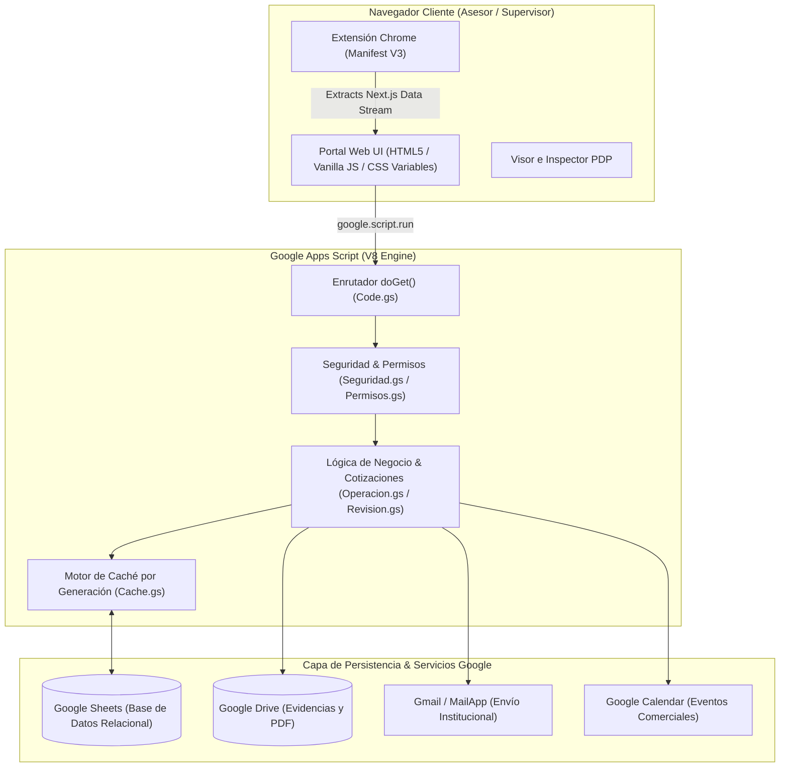

# Portal Ventel — Manual Técnico y Guía de Mantenimiento

> **DOCUMENTACIÓN TÉCNICA OFICIAL DE ARQUITECTURA Y MANTENIMIENTO**
> **Sistema Integral de Cotizaciones, Operación y Extensión de Comercio · Liverpool**

---

## 📋 Información del Documento

| Atributo | Detalle |
| :--- | :--- |
| **Proyecto** | Sistema Integral Portal Ventel & Extensión Chrome |
| **Versión del Sistema** | v0.9 (Pruebas de Control / Producción Inicial) |
| **Plataforma Base** | Google Apps Script (V8 Engine) + Google Sheets + Chrome Extension (Manifest V3) |
| **Autor y Desarrollador** | **David Martínez** |
| **Correo Institucional** | `dmartineza02@liverpool.com.mx` |
| **Organización** | El Puerto de Liverpool · Equipo Ventel |
| **Fecha de Última Revisión** | Agosto 2026 |

---

## 🎯 Propósito del Sistema

El **Portal Ventel** es un ecosistema de software distribuido diseñado para agilizar, estandarizar y supervisar el proceso comercial de cotizaciones, atención pospuesta a clientes y monitoreo de estado de operación de los sistemas operativos (Connect, Página/App, Salesforce, CCAIP) en El Puerto de Liverpool.

El ecosistema está compuesto por dos grandes pilares:
1. **Web App Monolítica (Google Apps Script + HTML5/JS):** Sirve como backend relacional, motor de reglas de negocio, motor de renderizado PDF/HTML, panel de supervisión, consola de administración maestra y módulo de incidentes operativos.
2. **Extensión de Navegador (Chrome Extension Manifest V3):** Actúa como un agente local en la sesión del asesor para extraer metadatos profundos de productos, carritos de compra y confirmaciones de orden directamente desde `liverpool.com.mx` (reconstruyendo el stream de datos React Server Components / Next.js Flight Data) e inyectándolos de forma segura al portal mediante un puente con `chrome.storage.local`.

---

## 📚 Índice de la Documentación Técnica

La documentación del sistema se encuentra estructurada en 8 manuales técnicos especializados ubicados en esta carpeta:

1. [**00_README_Inicio.md**](file:///C:/Users/seguimientos/Desktop/Portal%20Ventel/Documentacion/00_README_Inicio.md): Visión general, índice maestro y datos del autor.
2. [**01_Arquitectura_General.md**](file:///C:/Users/seguimientos/Desktop/Portal%20Ventel/Documentacion/01_Arquitectura_General.md): Arquitectura serverless monolítica, topología de componentes, matriz de integración y límites de cuota de Google.
3. [**02_Backend_GoogleAppsScript.md**](file:///C:/Users/seguimientos/Desktop/Portal%20Ventel/Documentacion/02_Backend_GoogleAppsScript.md): Análisis detallado de los 24 archivos `.gs`, motor de enrutamiento (`doGet`), capa de caché relacional por generación (`Cache.gs`), candados de concurrencia (`LockService`) y algoritmos de similitud fuzzy (Damerau-Levenshtein y Sorenson-Dice).
4. [**03_Frontend_y_Vistas.md**](file:///C:/Users/seguimientos/Desktop/Portal%20Ventel/Documentacion/03_Frontend_y_Vistas.md): Arquitectura de componentes de interfaz, patrón SWR (Stale-While-Revalidate), paleta de comandos (`Ctrl+K`), morphing SVG de estado operativo y motor de temas (`aurora`, `slate`, `carbon`).
5. [**04_BaseDeDatos_y_Hojas.md**](file:///C:/Users/seguimientos/Desktop/Portal%20Ventel/Documentacion/04_BaseDeDatos_y_Hojas.md): Esquema de tablas en Google Sheets, resistencia contra alteraciones de columnas por usuarios, columnas auto-reparables y preservación de fórmulas.
6. [**05_Extension_Chrome.md**](file:///C:/Users/seguimientos/Desktop/Portal%20Ventel/Documentacion/05_Extension_Chrome.md): Funcionamiento interno de la extensión (v1.7), desensamble del stream Next.js Flight Data, puente aislado de mensajes (`bridge.js`) y visores avanzados.
7. [**06_Seguridad_y_Permisos.md**](file:///C:/Users/seguimientos/Desktop/Portal%20Ventel/Documentacion/06_Seguridad_y_Permisos.md): Modelo de seguridad RBAC de 23 bloques y 3 roles, hoja oculta `_PermisosSistema`, mitigación de fuerza bruta, tokens de un solo uso (`vales`) y hash de contraseñas con salting.
8. [**07_Guia_de_Mantenimiento_y_Operacion.md**](file:///C:/Users/seguimientos/Desktop/Portal%20Ventel/Documentacion/07_Guia_de_Mantenimiento_y_Operacion.md): Runbook de operación para el equipo de TI, resolución de incidentes comunes, mantenimiento de selectores por cambios en Liverpool.com.mx y funciones de diagnóstico rápido (`revisionMaestra()`, `NOMBRAR_MAESTRO()`).

---

## 🛠️ Stack Tecnológico Resumido

---

## ✍️ Firma de Responsabilidad Técnica

Este manual y todos los documentos adjuntos de esta carpeta han sido redactados y validados exhaustivamente para garantizar que el equipo de soporte, mantenimiento y desarrollo futuro de Liverpool pueda administrar la plataforma sin ambigüedades.

**David Martínez**  
*Escritor y Arquitecto Principal del Sistema*  
Correo Institucional: `dmartineza02@liverpool.com.mx`  
El Puerto de Liverpool · Equipo Ventel  
*Agosto de 2026*
