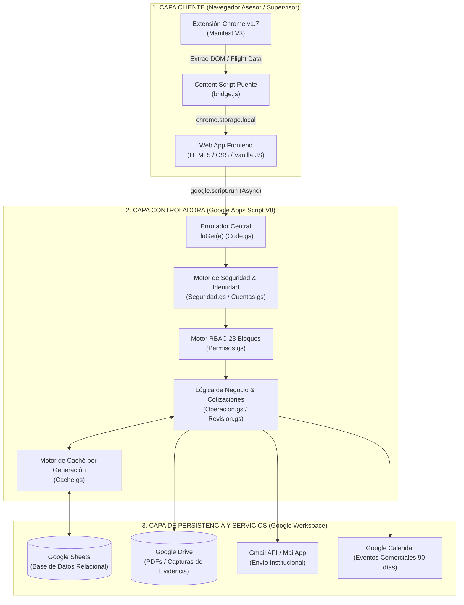

# Arquitectura General del Sistema

> **DOCUMENTACIÓN TÉCNICA OFICIAL DE ARQUITECTURA Y MANTENIMIENTO**
> **Sistema Integral Portal Ventel & Extensión Chrome**

---

## 🏗️ Visión General de la Arquitectura

El Portal Ventel está construido bajo un patrón de **Monolito Serverless Distribuido**, alojado íntegramente en la infraestructura de Google Workspace (Google Apps Script runtime V8) e integrado con el navegador del usuario a través de una Extensión de Chrome Manifest V3.

Esta arquitectura fue seleccionada deliberadamente para lograr:
1. **Cero costo de infraestructura adicional:** Opera utilizando las licencias existentes de Google Workspace de Liverpool.
2. **Despliegue inmediato (Time-to-Market):** Las actualizaciones de backend se reflejan de forma instantánea al publicar una nueva versión en Apps Script.
3. **Seguridad perimetral administrada:** Toda la comunicación ocurre bajo canales cifrados HTTPS administrados por Google con autenticación basada en dominio.

---

## 🧩 Componentes del Ecosistema

### 1. Capa Cliente (Navegador)
- **Web App UI:** Interfaz de usuario servida a través de un `iframe` seguro de Google (`*.googleusercontent.com`). No depende de frameworks pesados (React/Angular) para garantizar carga instantánea dentro de la sandbox de Google.
- **Extensión de Chrome (v1.7):** Extractor local que opera sobre `liverpool.com.mx`. Inspecciona el DOM y desensambla la transmisión de datos `self.__next_f.push` (Next.js React Server Components) para obtener atributos de productos, precios públicos/descuentos, promociones de meses sin intereses (MSI), listas de imágenes y datos de compras realizadas.
- **Puente `bridge.js`:** Script inyectado a nivel `document_start` en el dominio de Apps Script que actúa como puente de mensajes asíncronos (`window.postMessage`) entre `chrome.storage.local` y el formulario de cotización.

### 2. Capa Controladora (Backend Apps Script)
- **Enrutador `Code.gs`:** Punto de entrada único (`doGet`) que gestiona 16 páginas privadas (`PAGES`) y 3 páginas públicas (`PORTAL_PAGES`). Inyecta parámetros de vista (`PARAMS_VISTA`) en todas las plantillas.
- **Motor de Caché Relacional (`Cache.gs`):** Capa de aceleración de lectura en memoria sobre `CacheService`. Utiliza el patrón de **Invalidación por Generación de Base de Datos**: cualquier operación de escritura incrementa un contador global (`COT_CACHE_GEN`), invalidando de forma instantánea todas las entradas de caché obsoletas en todo el sistema.
- **Motor de Exclusión Mutua (`LockService`):** Aplica candados de concurrencia de hasta 30 segundos durante la creación de folios (`LVP-YYMMDD-XXXX`) y registro de atenciones, evitando condiciones de carrera cuando múltiples usuarios cotizan al mismo segundo.

### 3. Capa de Persistencia y Servicios (Google Workspace)
- **Google Sheets:** Base de datos relacional distribuida en hojas operativas (`Registros`, `Cotizaciones`, `DetalleCotizaciones`, `OperacionReportes`, etc.) y hojas ocultas de sistema (`_PermisosSistema`, `_PreferenciasUsuario`).
- **Google Drive:** Almacenamiento de archivos PDF de cotizaciones generadas y evidencias en imagen cargadas en reportes de caídas del sistema.
- **Gmail / MailApp:** Servicio de envío institucional de correos con PDF adjunto usando el alias corporativo `cotizacion@liverpool.com.mx`.

---

## ⚡ Capacidad, Concurrencia y Cuotas del Sistema

Es fundamental que el equipo de TI y Mantenimiento comprenda las **fronteras operativas** del sistema para evitar sobrepasar los límites de cuotas impuestos por Google Workspace:

| Recurso / Operación | Límite de la Plataforma Google | Estrategia de Mitigación Implementada |
| :--- | :--- | :--- |
| **Ejecuciones Simultáneas** | Máximo 30 ejecuciones simultáneas por script. | Lecturas optimizadas mediante `Cache.gs`. Las lecturas no pegan a Sheets. |
| **Tiempo de Ejecución por Llamada** | 6 minutos máximo por llamada backend. | Consultas divididas y procesamiento paralelo de imágenes en `Correos.gs`. |
| **Escritura en Google Sheets** | ~1 a 2 escrituras por segundo recomendadas. | Candado ScriptLock (`LockService`) en `saveQuoteAndGoToPreview` y batching de filas. |
| **Tamaño de Clave en ScriptCache** | 100 KB por entrada individual. | Fragmentado automático de JSON pesados hasta en 20 trozos (~1.8 MB) en `Cache.gs`. |
| **Límite de Envíos de Correo** | 1,500 correos / día (Cuentas Workspace). | Registro y métricas en `Metricas.gs` con alerta de cuota previa. |
| **Navegación en Iframe (Chrome)** | 5 segundos de userActivation tras clic. | Sistema de alerta con enlace directo `NavAviso` en `app_core.html` si la llamada tarda >5s. |

### Veredicto de Capacidad en Producción
Para una célula operativa de **40 a 50 asesores concurrentes**, el sistema opera de manera óptima y fluida debido a que el 90% de las operaciones de lectura son atendidas directamente por la capa de caché (`CacheService`). Si la operación requiere escalar a >200 usuarios concurrentes escribiendo simultáneamente, se recomienda migrar la capa de persistencia (Google Sheets) a una base de datos PostgreSQL alojada en GCP/AWS, manteniendo la lógica de negocio intacta.

---

## ✍️ Firma de Responsabilidad Técnica

**David Martínez**  
*Escritor y Arquitecto Principal del Sistema*  
Correo Institucional: `dmartineza02@liverpool.com.mx`  
El Puerto de Liverpool · Equipo Ventel  
*Agosto de 2026*
