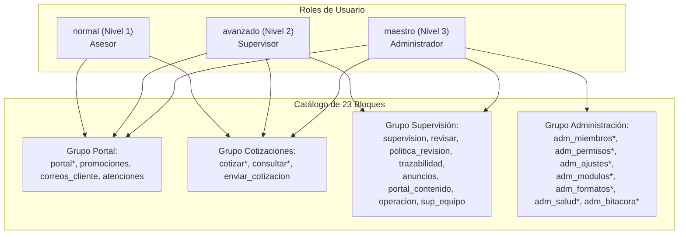

# Seguridad y Permisos — Especificación Técnica del Motor RBAC

> **DOCUMENTACIÓN TÉCNICA OFICIAL DE ARQUITECTURA Y MANTENIMIENTO**
> **Sistema Integral Portal Ventel & Extensión Chrome**
> **Autor:** David Martínez (`dmartineza02@liverpool.com.mx`)

---

## 🔒 Arquitectura de Seguridad e Identidad

El Portal Ventel utiliza un modelo de autenticación y autorización desacoplado de la cuenta de usuario de Google en el navegador, ofreciendo un control de acceso granular basado en roles y permisos (RBAC) gestionado a través de la hoja oculta del sistema `_PermisosSistema`.

---

## ⚙️ Especificación de los 4 Modos de Autenticación (`AUTH_MODO`)

El comportamiento de verificación de identidad se gobierna mediante la propiedad `AUTH_MODO` en `Seguridad.gs`:

| Modo | Valor | Comportamiento | Uso Recomendado |
| :--- | :--- | :--- | :--- |
| **Portal** | `'portal'` *(Default)* | Toma `AppSession.userEmail` enviado desde el portal. Si no se provee, utiliza la cuenta de Google. | **Producción.** Estaciones de trabajo compartidas. |
| **Auto** | `'auto'` | Ignora la sesión del portal y utiliza automáticamente el correo de la cuenta de Google del navegador. | Entornos de prueba en un solo equipo. |
| **Estricto** | `'estricto'` | Exige coincidencia exacta entre `AppSession.userEmail` y la cuenta de Google del navegador. | Entornos corporativos de alta seguridad. |
| **Legado** | `'legado'` | Toma la cuenta de Google sin validar la hoja `Registros` ni la matriz de permisos. | Compatibilidad con versiones antiguas. |

---

## 🔑 Algoritmos Criptográficos y Protección

### 1. Hash de Contraseña con Salting (`secHashContrasena_`)
Las contraseñas de usuario se almacenan como resúmenes Hexadecimales SHA-256 concatenados con la semilla global `HASH_SALT`:
$$\text{Digest} = \text{SHA256}(\text{Password} + \text{HASH\_SALT})$$

### 2. Comparación de Tiempo Constante (`secComparacionSegura_`)
Para evitar ataques de temporización (donde un atacante deduce caracteres midiendo tiempos de respuesta de milisegundos), la comparación de digests utiliza una operación XOR acumulativa de tiempo constante.

### 3. Freno a la Fuerza Bruta (`secIntentosRevisar_`)
- **Límite:** 8 intentos fallidos.
- **Ventana:** 15 minutos (900 segundos).
- **Almacenamiento:** `CacheService` volátil. No impacta la base de datos de Sheets.

### 4. Ciclo de Vida de Códigos OTP y Vales (`vales`)
- **Código OTP:** 6 dígitos numéricos emitidos mediante `cuentasEmitirCodigo_`. Vigencia de 10 minutos, máximo 5 intentos por código y máximo 5 códigos por hora por usuario.
- **Vale de Restablecimiento (`vale`):** Token UUID de un solo uso emitido tras confirmar el OTP. Tiene 15 minutos de expiración. La llamada a `restablecerContrasena` o `establecerPasswordInicial` invalida el `vale` de forma inmediata.

---

## 🛡️ Matriz RBAC: Catálogo de 23 Bloques y 3 Roles



*\* Nota: Los bloques marcados con asterisco `*` son fijos del rol y no pueden ser revocados.*

---

## 📋 Diccionario Completo de los 23 Bloques de Permisos

| ID del Bloque | Grupo | Nombre Visible | Descripción | R/W |
| :--- | :--- | :--- | :--- | :--- |
| `portal` | Portal | Navegar Portal | Acceso a la interfaz pública del portal. | Lectura |
| `promociones` | Portal | Monitor Promociones | Acceso al monitor de promociones y Marketplace. | Lectura |
| `correos_cliente`| Portal | Correos a Clientes | Enviar plantillas HTML de correo a clientes. | Escritura |
| `atenciones` | Portal | Atenciones Pospuestas | Gestionar y rescatar clientes en atención. | Escritura |
| `cotizar` | Cotizaciones | Crear Cotización | Generar nuevas cotizaciones. | Escritura |
| `consultar` | Cotizaciones | Consultar Propias | Ver el historial de cotizaciones del asesor. | Lectura |
| `enviar_cotizacion`| Cotizaciones| Enviar Cotización | Enviar PDF por correo electrónico. | Escritura |
| `supervision` | Supervisión | Tablero Supervisión | Ver todas las cotizaciones del equipo. | Lectura |
| `revisar` | Supervisión | Cola de Revisión | Aprobar o rechazar cotizaciones en revisión. | Escritura |
| `politica_revision`| Supervisión| Política Revisión | Definir reglas de aprobación automática. | Escritura |
| `trazabilidad` | Supervisión | Homologación 2026 | Consultar matriz de trazabilidad de procesos. | Lectura |
| `anuncios` | Supervisión | Anuncios del Portal | Crear y publicar anuncios y banners. | Escritura |
| `portal_contenido`| Supervisión| Editor Contenido | Administrar las 9 colecciones del portal. | Escritura |
| `operacion` | Supervisión | Estado Operación | Confirmar y descartar fallas del servicio. | Escritura |
| `sup_equipo` | Supervisión | Equipo de Asesores | Administrar usuarios de nivel inferior. | Escritura |
| `adm_miembros` | Administración| Gestor Miembros | Alta, baja y reseteo de usuarios. | Admin |
| `adm_permisos` | Administración| Gestor Permisos | Modificar matriz RBAC y bloques. | Admin |
| `adm_ajustes` | Administración| Ajustes Globales | Configurar llaves y webhooks en ScriptProperties. | Admin |
| `adm_modulos` | Administración| Módulos Apagados | Encender/Apagar módulos por mantenimiento. | Admin |
| `adm_formatos` | Administración| Formatos Cotización | Habilitar o deshabilitar formatos de PDF. | Admin |
| `adm_salud` | Administración| Salud del Sistema | Ejecutar suite de diagnóstico `revisionMaestra()`. | Admin |
| `adm_bitacora` | Administración| Bitacora Auditoría | Ver historial de cambios en `BitacoraConsola`. | Admin |

---

## 🗃️ Esquema JSON de Overrides en `_PermisosSistema`

La celda `Permisos` en la hoja `_PermisosSistema` almacena las personalizaciones por usuario en formato JSON:

```json
{
  "mas": ["operacion", "anuncios"],
  "menos": ["enviar_cotizacion"]
}
```

- `mas`: Lista de bloques adicionales otorgados al usuario por encima de su rol base.
- `menos`: Lista de bloques revocados al usuario de su rol base.

---

## ✍️ Firma de Responsabilidad Técnica

**David Martínez**  
*Escritor y Arquitecto Principal del Sistema*  
Correo Institucional: `dmartineza02@liverpool.com.mx`  
El Puerto de Liverpool · Equipo Ventel  
*Agosto de 2026*
