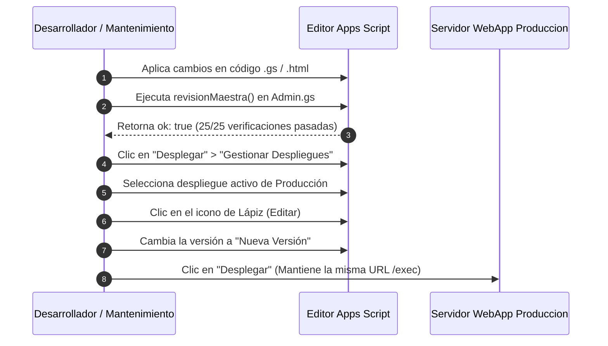

# Guía de Mantenimiento y Manual de Operación (Runbook Técnico)

> **DOCUMENTACIÓN TÉCNICA OFICIAL DE ARQUITECTURA Y MANTENIMIENTO**
> **Sistema Integral Portal Ventel & Extensión Chrome**
> **Autor:** David Martínez (`dmartineza02@liverpool.com.mx`)

---

## 🛠️ Guía de Ejecución de Funciones de Diagnóstico (Editor de Apps Script)

Esta sección describe el propósito y procedimiento para ejecutar cada una de las **12 funciones de diagnóstico e inspección manual** desde el entorno de desarrollo de Google Apps Script.

---

### 📋 Catálogo de Funciones de Diagnóstico Backend

| Función | Archivo | Propósito Operativo |
| :--- | :--- | :--- |
| **`revisionMaestra()`** | `Admin.gs` | **Suite Principal de Salud.** Corre 25 comprobaciones en 9 subsistemas. |
| **`NOMBRAR_MAESTRO()`** | `Permisos.gs` | Restaura el rol `maestro` al correo `dmartineza02@liverpool.com.mx`. |
| **`REPARAR_MAESTRO()`** | `Permisos.gs` | Repara inconsistencias en la hoja ocultas de permisos del sistema. |
| **`VER_PERMISOS_GUARDADOS()`** | `Permisos.gs` | Imprime en el Logger todos los registros activos en `_PermisosSistema`. |
| **`VER_CORREOS_REGISTRADOS()`**| `Permisos.gs` | Imprime en el Logger todos los usuarios registrados y sus roles efectivos. |
| **`cotInvalidarCache_()`** | `Cache.gs` | **Limpieza de Caché General.** Incrementa el contador `COT_CACHE_GEN`. |
| **`diagPromos()`** | `DiagnosticoPromos.gs` | Diagnostica hojas comerciales, vigencias e índice de promociones. |
| **`trazDiagnostico()`** | `Trazabilidad.gs` | Comprueba acceso y lectura de las 6 pestañas de trazabilidad 2026. |
| **`audDiagnostico()`** | `AuditoriaCotizacion.gs` | Prueba el motor determinista de 8 puntos de auditoría con datos de prueba. |
| **`probarAccesoCcl()`** | `Formatos.gs` | Prueba la clonación, edición y borrado de la plantilla de impresión CCL. |
| **`secDiagnostico()`** | `Seguridad.gs` | Verifica la configuración de seguridad y la resolución de identidades. |
| **`cuentasDiagnostico()`** | `Cuentas.gs` | Comprueba el almacenamiento de códigos OTP y cuotas de envío de correo. |

---

## 📖 Runbook de Procedimientos de Mantenimiento

### 🛑 Escenario 1: Cambios de Estructura en Liverpool.com.mx (Mantenimiento de Extensión)
- **Síntoma:** La extensión de Chrome deja de extraer precios, imágenes o títulos de productos.
- **Causa:** El equipo de desarrollo web de Liverpool modificó las clases CSS, selectores `data-testid` o la estructura del stream Next.js.
- **Solución:**
  1. Abre `liverpool.com.mx` en una pestaña de Chrome con un producto afectado.
  2. Haz clic derecho > *Inspeccionar* y analiza la nueva estructura del DOM.
  3. Revisa si los atributos `data-testid` cambiaron (ej. `[data-testid="original"]` -> `[data-testid="price-original"]`).
  4. Abre los archivos `deep-extractor.js` y `product-inspector.js` de la carpeta `Extencion para chrome/`.
  5. Actualiza los selectores en las funciones `cosecharTarjetasBolsa()` y `parsePriceFromNode()`.
  6. Si cambió la estructura del stream RSC, ajusta las expresiones regulares en `cosecharFlight()`.
  7. Incrementa el campo `"version"` en `manifest.json` (ej. `1.7` -> `1.8`) y reempaqueta la extensión para su distribución.

---

### 🔑 Escenario 2: Restablecimiento de Emergencia del Administrador Maestro
- **Síntoma:** Todos los usuarios administradores perdieron acceso a la consola o la hoja `_PermisosSistema` fue borrada accidentalmente.
- **Solución:**
  1. Abre el proyecto en el editor de Apps Script.
  2. En la barra superior de selección de funciones, elige `NOMBRAR_MAESTRO`.
  3. Haz clic en **Ejecutar**.
  4. La función recreará la hoja oculta `_PermisosSistema` (si fue borrada) y otorgará permisos de `maestro` al correo `dmartineza02@liverpool.com.mx`.

---

### 🔄 Escenario 3: Limpieza Forzada de Caché por Datos Desactualizados
- **Síntoma:** Los usuarios reportan que ven promociones o datos de herramientas desactualizados en el portal web.
- **Solución:**
  1. En el editor de Apps Script, selecciona la función `cotInvalidarCache_` en `Cache.gs`.
  2. Haz clic en **Ejecutar**.
  3. Esto incrementará el contador global `COT_CACHE_GEN`, forzando a todas las sesiones activas a consultar datos frescos directamente desde Google Sheets.

---

### ⚠️ Escenario 4: Bloqueo o Límite de Tiempo por Concurrencia en Sheets
- **Síntoma:** Múltiples asesores reciben la alerta `"El sistema está ocupado guardando otra cotización"`.
- **Causa:** Más de 5 usuarios intentaron guardar una cotización en el mismo segundo exacto superando los 30 segundos del candado `LockService`.
- **Solución:**
  1. Solicita a los asesores esperar 5 segundos antes de reintentar.
  2. Si el volumen operativo crece de forma permanente, abre `Code.gs` y ajusta el tiempo de espera del candado en `saveQuoteAndGoToPreview`:
     ```javascript
     if (!lock.tryLock(45000)) { // Incrementar a 45 segundos
       throw new Error("El sistema está ocupado guardando otra cotización. Intenta de nuevo en unos segundos.");
     }
     ```

---

### 🚀 Escenario 5: Procedimiento Estándar de Despliegue de Nuevas Versiones WebApp



> 🚨 **REGLA DE ORO:** Nunca utilices la opción "Nuevo Despliegue" para una actualización en producción. Utiliza siempre **"Gestionar Despliegues" > "Editar" > "Nueva Versión"**. Esto garantiza que la URL del sistema (`.../exec`) se mantenga exactamente igual para todos los usuarios y marcadores del equipo.

---

## ✍️ Firma de Responsabilidad Técnica

**David Martínez**  
*Escritor y Arquitecto Principal del Sistema*  
Correo Institucional: `dmartineza02@liverpool.com.mx`  
El Puerto de Liverpool · Equipo Ventel  
*Agosto de 2026*
